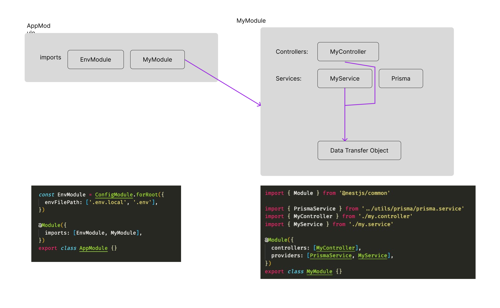

# Nestjs-Passport-MFA

This is a server implementation of a Nestjs server that leverages Passportjs & Google Authenticator for the MFA. It is also written in Typescript and uses Docker for the Postgres Database and prisma to CRUD the data for the app


# Getting Started
1. Make your .env file
  - You can create a random key for you `JWT_SECRET` & `JWT_REFRESH_TOKEN_SECRET` by running `$ make key`
  - Example `.env` file
    ```bash
    PORT=3003

    MFA_AUTHENTICATION_APP_NAME="nestjs-passport-mfa"
    JWT_SECRET=""
    JWT_EXPIRATION_TIME=900 # 15mins #  60 * 60 * 24 or 1min(60) 1hour(3600) 1 day(86400)
    JWT_REFRESH_TOKEN_SECRET=""
    JWT_REFRESH_TOKEN_EXPIRATION_TIME=86400 # 1day
    ```

2. Run the DB (in a docker container) & run the Nestjs server
  ```shell
  $ make db
  $ make dev
  ```
3. Open up Postman and load the `./postman/*` 

4. Register a new user via [POST]=>`{{base_url}}/auth/register` with the post body
  ```json
  {
    "email": "tpain@tpain.com",
    "name": "mr tpain",
    "password": "123456789"
  }
  ```
5. Take the `mfa_token` to get a valid `access_token`
  - Take the `mfa_token` to and save it to the Environment variable `mfa_token` and save. 
  - Make a [POST]=>`{{base_url}}/2fa/generate`
  - Use Google Authenticator app to scan the image
6. Make a [POST]=>`{{base_url}}/2fa/authenticate`
  ```json
  {
      "mfaAuthenticationCode": "*****"
  }
  ```
7. Add a quote [post]=>`{{base_url}}/quotes`
  ```json
  {
    "author": "that hohoho",
    "quote":"yeeeeep think think"
  }
  ```


# About Nestjs
- Backend frameword build on top of express
- Opinionated, and has a similar `Angular` feel (good & bad)
- Wired up with Prisma (ORM to deal with database)
- Local Postgres DB with Docker
- NEST CLI
    ```shell
    $ npm i -g @nestjs/cli
    $ nest new project-name
    
    # Create a complete new resource
    $ nest generate resource
    ```
- Module = [controller + service]
  


# Dev
```shell
$ yarn 
$ yarn start:dev
```

# Build
- Build & zip the application with only the node_modules needed for the app
  ```shell
  $ yarn build
  ```
- Create a docker container
  ```shell
  $ yarn build:docker
  ```


# PG Admin
- Go to PGAdmin to see our database, got to http://localhost:8080
  - Login with:
    ```json
    {
      name: container-postgresdb,
      host: host.docker.internal,
      database: postgres,
      user: postgres,
      password: admin
    }
    ```
- Create a `docker.env` file with
  ```shell
  POSTGRES_USER=admin
  POSTGRES_PASSWORD=admin
  POSTGRES_DB=nestjs
  PGADMIN_DEFAULT_EMAIL=admin@admin.com
  PGADMIN_DEFAULT_PASSWORD=admin
  ```


# Login flow
- Install Google Authenticator mobile app or chrome extension

- Register/login (both get a `mfa_token`)
1. [POST] {{base_url}}/authentication/register
2. [POST] {{base_url}}/authentication/login

- Enable 2Factor Auth (do this once)
  1. [POST] {{base_url}}/2fa/generate + `mfa_token`
  2. [POST] {{base_url}}/2fa/turn-on + `mfa_token`

- Get JWT accessToken
  1. [POST] {{base_url}}/2fa/authenticate + `mfa_token` + Google Authenticator code

- Make calls the the REST service
  - [GET] {{base_url}}/quotes
  - [POST] {{base_url}}/quotes


